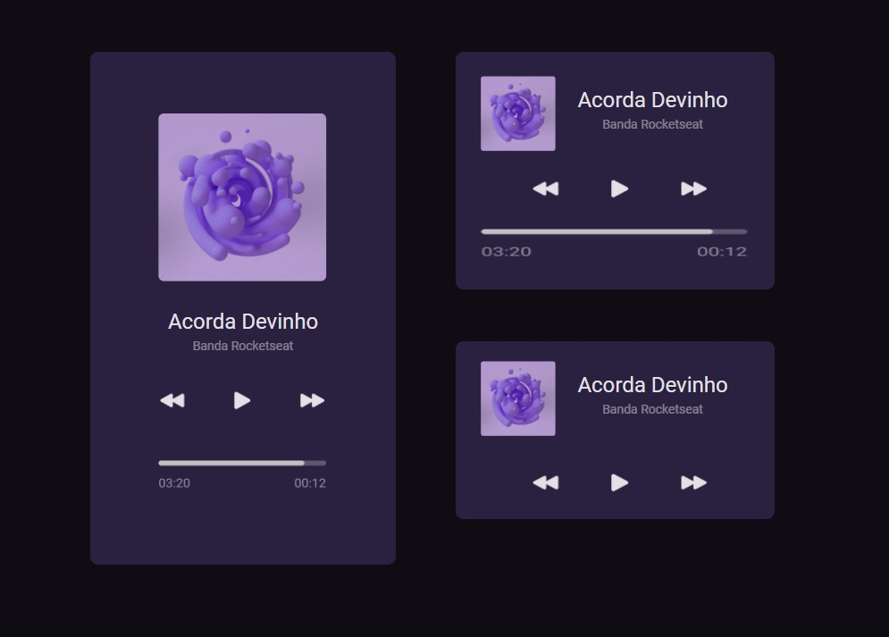

<h1 align = "center" > #boraCodar Um player de música </h1>

Programa exclusivo e gratuito, promovido pela Rocketseat para ensino de tecnologias WEB.  

  <a href="#-tecnologias">Tecnologias</a>&nbsp;&nbsp;&nbsp;|&nbsp;&nbsp;&nbsp;
  <a href="#-projeto">Projeto</a>&nbsp;&nbsp;&nbsp;|&nbsp;&nbsp;&nbsp;
  <a href="#-layout">Layout</a>&nbsp;&nbsp;&nbsp;|&nbsp;&nbsp;&nbsp;
  <a href="#memo-licença">Licença</a>

  

## 🚀 Tecnologias

Esse projeto foi desenvolvido com as seguintes tecnologias:

- HTML e CSS
- Git e Github
- Figma

## 💻 Projeto

Desafio #01 - um player de música

Desenvolva o player conforme especificado utilizando as tecnologias da sua preferência. Você pode adicionar outros detalhes, como animações.

O #boraCodar foi criado pela Rocketseat, para desafiar nossas habilidades na programação e criarmos projetos do zero.

Será lançado um desafio por semana todas as quartas-feiras.

O primeiro desafio já está disponível. Acesse agora mesmo o link: https://rseat.in/boracodar e vamos juntos evoluir na programação 🚀

## :memo: Licença

Esse projeto está sob a licença MIT.

---

Desafio Rocketseat e criado por mim ♥ 
[Participe desta comunidade incrivel!](https://discord.gg/rocketseat) :wave: 
